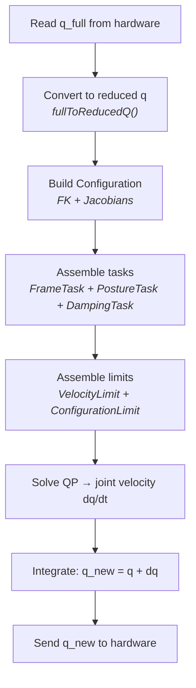
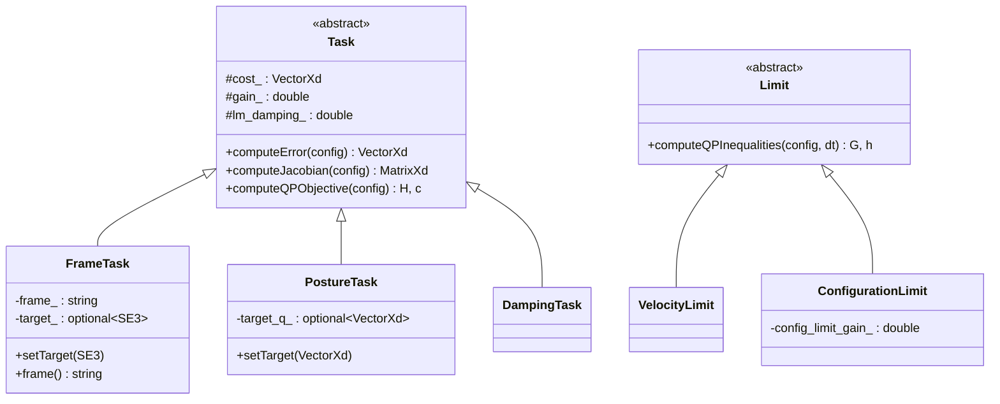

# Controller & IK Solver

## Controller

The `Controller` runs every `RobotSystem::update()` call. It operates in one of three modes:

| Mode | Behavior |
|---|---|
| `IDLE` | No commands are sent. The robot holds its current MuJoCo position. |
| `JOINT_SPACE` | Target joint positions are sent directly to the hardware driver. No IK. |
| `TASK_SPACE` | The IK solver runs each tick to track an SE3 target pose. |

### Mode Switching

Calling `setTaskSpaceTarget()` switches to `TASK_SPACE`. Calling `setJointSpaceTarget()` switches to `JOINT_SPACE`. There is no explicit way to set `IDLE` — the controller starts idle and transitions on the first target.

### Task-Space Update Cycle



Each `update()` in `TASK_SPACE` mode:

1. Read `q_full` from hardware, convert to reduced `q` (strip gripper DOF).
2. Build a `Configuration` from `q`.
3. Assemble tasks: `[FrameTask, PostureTask, DampingTask]`.
4. Assemble limits: `[VelocityLimit, ConfigurationLimit]`.
5. Call `ik_solver_.solve()` to get joint velocity `dq/dt`.
6. Integrate: `q_new = q + dq`.
7. Send `q_new` to the hardware driver.

### Lazy Initialization

IK components (tasks, limits) are created lazily on the first `setTaskSpaceTarget()` call. The `PostureTask` target is set to the current configuration at that moment, so the robot regularizes toward wherever it was when task-space control began.

## IK Solver

The IK solver formulates a **Quadratic Program (QP)** that is solved with [OSQP](https://osqp.org/) via the [OsqpEigen](https://github.com/robotology/osqp-eigen) wrapper.

### QP Formulation

```
min   0.5 · dq^T · H · dq  +  c^T · dq
s.t.  G · dq  ≤  h
```

Where:

- `dq` is the joint velocity to solve for (dimension `nv`)
- `H` and `c` come from summing task objectives
- `G` and `h` come from stacking limit constraints

The solver returns `v = dq / dt`.

### Building the QP

For each task, `computeQPObjective()` returns a `(H_i, c_i)` pair:

```
J = task Jacobian
e = task error
W = diagonal cost weights

H_i = (W·J)^T · (W·J)  +  μ·I    (Levenberg-Marquardt damping)
c_i = -(W·J)^T · (W·e)
```

Where `μ = lm_damping · ||W·e||²` provides adaptive regularization near singularities.

A small Tikhonov damping term `damping · I` (default `1e-12`) is added to the total `H` for numerical stability.

### Constraint Stacking

For each limit, `computeQPInequalities()` returns an optional `(G_i, h_i)` pair. These are vertically stacked:

```
G = [G_velocity; G_configuration]
h = [h_velocity; h_configuration]
```

### Unconstrained Fallback

If there are no active constraints, the solver skips OSQP and uses a direct Cholesky solve:

```
dq = H.ldlt().solve(-c)
```

If OSQP fails (returns a non-optimal status), the solver also falls back to this unconstrained solution with a warning.

## Tasks

Tasks define the QP objective — what the robot should try to achieve. All tasks inherit from the abstract `Task` base class.



### FrameTask

Tracks a target SE3 pose for a named frame.

```cpp
FrameTask task("gripper_frame_link", /*position_cost=*/1.0, /*orientation_cost=*/1.0);
task.setTarget(target_se3);
```

- **Error**: `log6(T_frame^{-1} · T_target)` — the body-frame twist between current and target pose.
- **Jacobian**: `-Jlog6(T_frame_to_target) · J_frame` — maps joint velocity to task-space error reduction.
- **Cost weights**: Separate 3D weights for position (XYZ) and orientation (roll/pitch/yaw). Use `setPositionCost()` and `setOrientationCost()` to tune.

### PostureTask

Regularizes toward a reference joint configuration.

```cpp
PostureTask task(/*cost=*/1e-3);
task.setTargetFromConfiguration(config);
```

- **Error**: `pinocchio::difference(q, q_target)` on the configuration manifold.
- **Jacobian**: Identity on actuated joints (excludes any root joint).
- Keeps the arm near a natural pose and avoids unnecessary joint drift.

### DampingTask

Penalizes joint velocity to prevent erratic motions.

```cpp
DampingTask task(/*cost=*/1e-4);
```

- **Error**: zero vector (always).
- **Jacobian**: Identity on actuated joints.
- Acts as velocity damping — the cost penalizes `||dq||²`.

## Limits

Limits define QP inequality constraints — what the robot must not violate.

### VelocityLimit

Constrains joint velocities to stay within the URDF-defined `velocity` limits:

```
-v_max · dt  ≤  dq  ≤  v_max · dt
```

Only active for joints that have finite velocity limits in the Pinocchio model. Joints with infinite limits are excluded.

### ConfigurationLimit

Prevents joints from exceeding their position limits:

```
q_min - q  ≤  dq  ≤  q_max - q
```

Scaled by a `config_limit_gain` (default `0.5`) that controls how aggressively the robot avoids limits. A value of `1.0` means "can move all the way to the limit in one step"; `0.5` means "only half the remaining margin per step".

## Cartesian Jogging

Cartesian jogging is implemented at the `RobotSystem` level, not in the controller:

```cpp
robot.jogCartesian(axis, sign, "gripper_frame_link");
```

Each call:

1. Reads the current frame pose via FK.
2. Applies a small translation (axes 0–2) or rotation (axes 3–5) delta.
3. Calls `setTaskSpaceTarget()` with the new pose, which triggers IK.

Linear and angular step sizes are configurable via `setJogStep()`.
