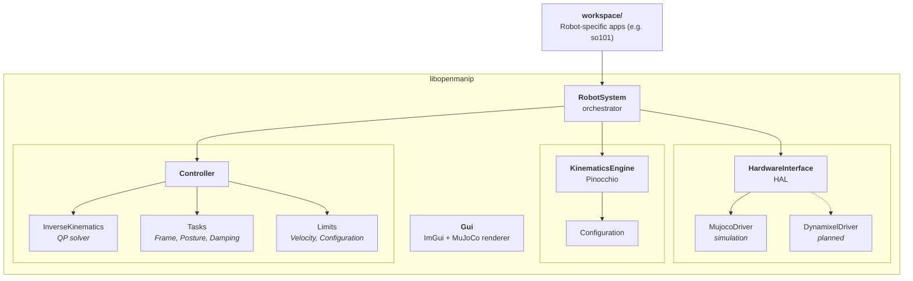
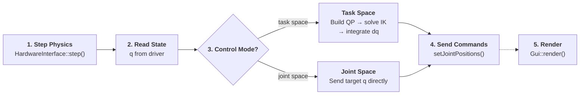

# Architecture Overview

OpenManip is structured as a shared library (`libopenmanip`) that robot-specific applications link against.



## Data Flow

Each `RobotSystem::update()` call follows this pipeline:



1. **Step physics** — `HardwareInterface::step()` advances the simulation (or reads real hardware).
2. **Read state** — Joint positions `q` are read from the driver and converted to the reduced kinematic model.
3. **Run controller** — Depending on the control mode:
    - *Task space* — The IK solver builds a QP from task objectives (end-effector tracking, posture regularization, damping) and constraints (velocity limits, configuration limits), solves for joint velocity `dq`, integrates to get new `q`, and sends it to the driver.
    - *Joint space* — Target joint positions are sent directly to the driver.
4. **Render** (when called) — The GUI reads MuJoCo state and renders the viewport and control panels.

## Component Responsibilities

| Component | Header | Responsibility |
|---|---|---|
| `RobotSystem` | `RobotSystem.hpp` | Top-level orchestrator — owns hardware, kinematics, and controller |
| `HardwareInterface` | `HardwareInterface.hpp` | Abstract driver interface for sim or real hardware |
| `MujocoDriver` | `MujocoDriver.hpp` | MuJoCo physics backend — loads MJCF, steps sim, reads/writes state |
| `KinematicsEngine` | `PinocchioModel.hpp` | Loads URDF into Pinocchio, builds full and reduced models |
| `Configuration` | `PinocchioModel.hpp` | Snapshot of robot state — FK, Jacobians, frame transforms, limit checks |
| `Controller` | `Controller.hpp` | Switches between idle, joint-space, and task-space control modes |
| `InverseKinematics` | `InverseKinematics.hpp` | QP-based differential IK solver using OSQP |
| `Task` | `Tasks.hpp` | Abstract QP objective — `FrameTask`, `PostureTask`, `DampingTask` |
| `Limit` | `Limits.hpp` | Abstract QP constraint — `VelocityLimit`, `ConfigurationLimit` |
| `Gui` | `Gui.hpp` | ImGui + MuJoCo offscreen renderer with joint/Cartesian control panels |
| `Logger` | `logger.hpp` | Colored console logging (info, warning, error) |

## Source Layout

```
src/
├── core/
│   └── RobotSystem.cpp        # Orchestrator implementation
├── physics/
│   └── MujocoDriver.cpp       # MuJoCo HAL driver
├── kinematics/
│   └── PinocchioModel.cpp     # KinematicsEngine + Configuration
├── control/
│   ├── Controller.cpp          # Control mode switching, IK dispatch
│   └── InverseKinematics.cpp   # QP assembly and OSQP solve
├── tasks/
│   └── Tasks.cpp               # FrameTask, PostureTask, DampingTask
├── limits/
│   └── Limits.cpp              # VelocityLimit, ConfigurationLimit
└── gui/
    └── Gui.cpp                 # ImGui panels + MuJoCo viewport
```

## Two Kinematic Models

Pinocchio maintains two models loaded from the same URDF:

- **Full model** — all joints including the gripper (e.g. 6 DOF for SO-101). Used for FK queries and GUI display.
- **Reduced model** — gripper joint locked via `pinocchio::buildReducedModel`. Used for IK so the solver plans only the arm joints without the gripper interfering.

`KinematicsEngine::fullToReducedQ()` converts between the two representations.
