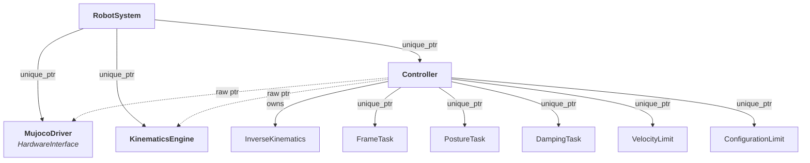

# RobotSystem

`RobotSystem` is the top-level class your application interacts with. It owns and orchestrates:

- A **hardware driver** (`MujocoDriver` by default)
- A **kinematics engine** (`KinematicsEngine` wrapping Pinocchio)
- A **controller** (joint-space or task-space with IK)

## Initialization

```cpp
openmanip::RobotSystem robot;
robot.initialize("/path/to/scene.xml", "/path/to/robot.urdf");
```

- `scene.xml` — MuJoCo MJCF scene description (world, robot, floor, lights)
- `robot.urdf` — URDF for Pinocchio kinematics (joint tree, frames, limits)

Internally `initialize()` calls `hardware_->connect()` to load the MuJoCo model and `kinematics_->initialize()` to build the Pinocchio models.

## Main Loop

```cpp
while (gui.windowIsOpen()) {
    robot.update();   // step physics + run controller
    gui.render();
}
```

Each `update()`:

1. Calls `hardware_->step()` to advance the physics simulation by one timestep.
2. Calls `controller_->update()` which reads the current joint state, runs IK if in task-space mode, and sends commands back to the driver.

## API Reference

### Joint Space

```cpp
robot.setJointSpaceTarget(q);          // Eigen::VectorXd — directly command joint positions
Eigen::VectorXd q = robot.getJointPositions();  // read current joint positions from hardware
```

Joint-space targets bypass IK entirely and write positions straight to the hardware driver's control inputs.

### Task Space

```cpp
robot.setTaskSpaceTarget(T, "gripper_frame_link");   // Eigen::Matrix4d (SE3 homogeneous)
Eigen::Matrix4d T = robot.getFramePose("gripper_frame_link");
```

Setting a task-space target switches the controller to `TASK_SPACE` mode. The IK solver runs every `update()` to track the target pose.

### Cartesian Jogging

```cpp
robot.setJogStep(0.005, 0.02);  // linear (meters), angular (radians)

// axis: 0=X, 1=Y, 2=Z, 3=Roll, 4=Pitch, 5=Yaw
// sign: +1.0 or -1.0
robot.jogCartesian(0, 1.0, "gripper_frame_link");   // jog +X
robot.jogCartesian(5, -1.0, "gripper_frame_link");   // jog -Yaw
```

Each jog call reads the current frame pose, applies a small delta (translation or rotation), and calls `setTaskSpaceTarget()` with the new pose.

### Home Position

```cpp
robot.setHomePosition();    // save current joint positions
robot.moveToHome();         // command back to saved position (joint-space)
bool ok = robot.hasHomePosition();
```

### Gripper

```cpp
robot.setGripperActuator(5);   // which MuJoCo actuator index to toggle (defaults to last)
robot.toggleGripper();          // flip between ctrlrange min and max
bool open = robot.isGripperOpen();
```

The gripper toggle reads the actuator's `ctrlrange` from the MuJoCo model and switches between the low and high values.

## Ownership Diagram



`RobotSystem` passes raw pointers to the kinematics and hardware into `Controller` at construction. All ownership is through `unique_ptr` so cleanup is automatic.
